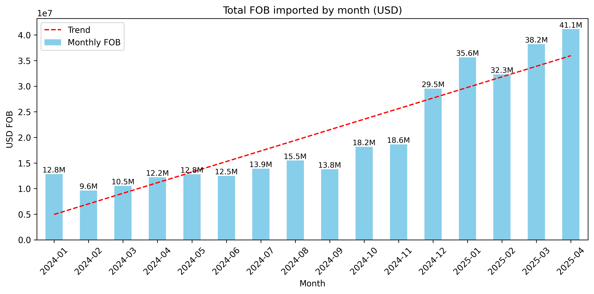
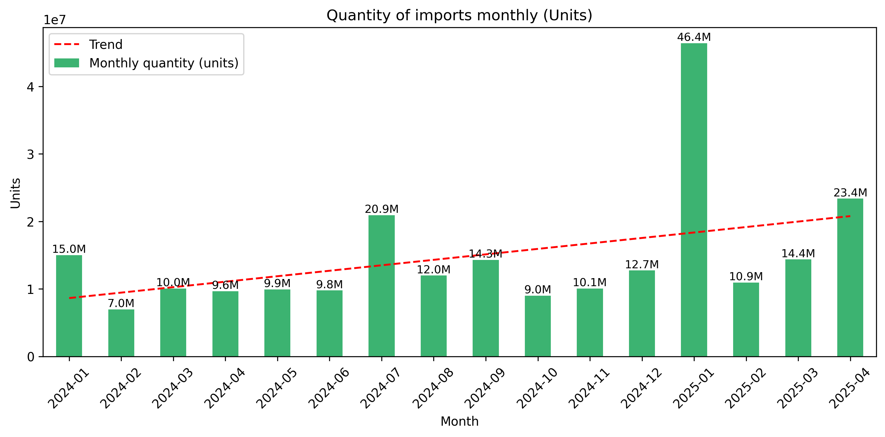

# Project_2

# 📦 Argentina Courier Imports Analysis (2024–2025)

This project analyzes the surge in courier imports in Argentina following the change in government in late 2023, which led to significant deregulation in foreign trade policies. Using official customs data from January 2024 to April 2025, we explore import trends, product types, customs entry points, and overall behavior changes in consumer and business import patterns.

## 🔍 Hypothesis

After the policy shift, new regulations allowed individuals and companies to import more freely, especially under the tax-free courier regime for purchases under USD 400. This led to a sharp increase in the quantity and diversity of imported products.

## 📊 Dataset

- Source: Argentina Customs (Aduana)
- Format: Excel and PDF for reference (HS code descriptions, customs codes)
- Period: January 2024 – April 2025
- Fields analyzed:
  - HS code (`POSICION`)
  - Customs office (`ADUANA`)
  - FOB value (`FOB_ENVIOS`)
  - Units (`CANT_UNIDAD`)
  - Import month (`FECHA_MES`)
  - Unit type (`DESC_TIPO_UNIDAD`)

## 🛠️ Main Tools Used

- Python (Pandas, NumPy, Matplotlib, PDFPlumber)
- Jupyter Notebook
- Visualizations exported as PNG
- Data cleaning and transformation for numeric and datetime fields

## 📈 Key Analyses

- **Top imported products** by quantity and value (FOB)
- **Trend over time**: Monthly import evolution (value & units)
- **Main customs entry points**: % share by customs office
- **Cost per unit analysis** by HS code
- **Product categorization** using HS code descriptions

## 📎 Visuals

### FOB Value by Month  

### Quantity of Imports (Units) by Month  

## 📁 Folder Structure

/data → Raw Excel & PDF files
/outputs → Charts and processed CSVs
notebooks/analysis → Main Jupyter notebook
README.md → This file

## 🧠 Insights

- HS code 3926.90 ("Other articles of plastics") was the most imported category by units.
- Entry points like **Ezeiza** and **Buenos Aires (Capital)** handle the majority of imports.
- There is a consistent upward trend in both value and volume through early 2025.

## 📝 Author

**Santiago Maestri**  
Journalist & Data Analyst  
Passionate about trade, policy, and economic behavior in Latin America.

---

